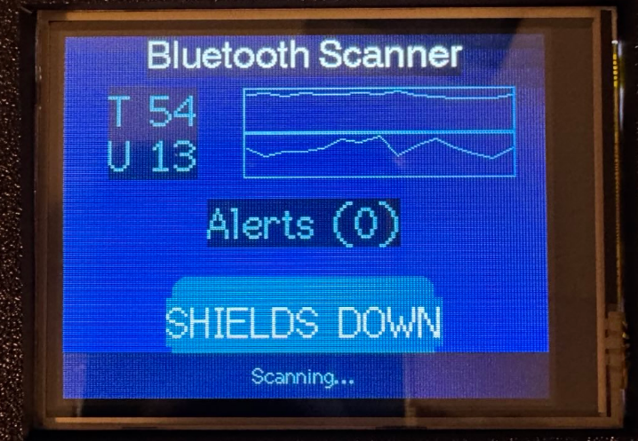
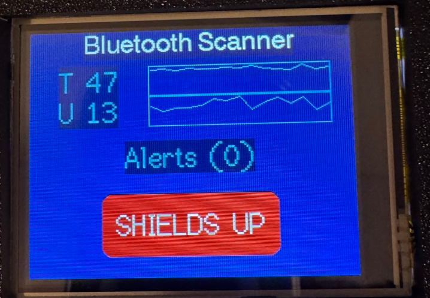
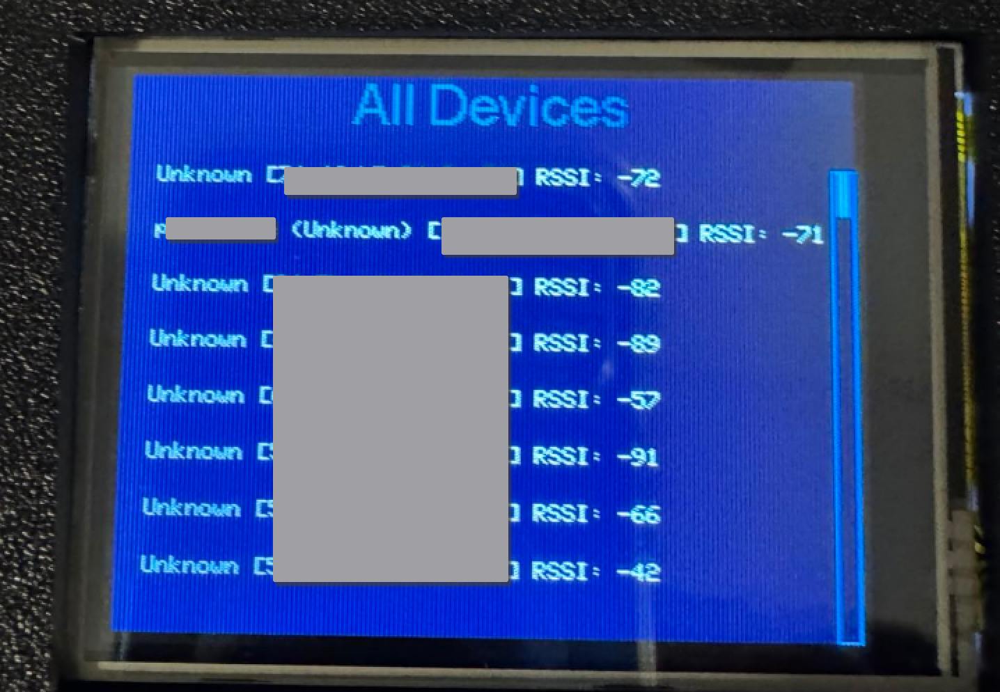

# Bluetooth Scanner with Shields Alert for ESP32 CYD



An advanced Bluetooth scanner for the ESP32 CYD device that monitors nearby Bluetooth devices and alerts you when new devices come within range. Ideal for operational security (opsec) and maintaining signal safety. Activate the shields using the touch screen and get notified instantly when unrecognized Bluetooth devices are detected.

## Table of Contents

- [Features](#features)
- [Hardware Requirements](#hardware-requirements)
- [Installation](#installation)
- [Usage](#usage)
- [Configuration](#configuration)
- [Contributing](#contributing)
- [License](#license)
- [Author](#author)

## Features

 

- **Real-Time Bluetooth Scanning**: Continuously scans for Bluetooth devices within approximately 60 feet.
- **Shield Mode**: Activate shields to get instant alerts when new devices are detected.
- **Touch Screen Interface**: Intuitive UI with a SHIELDS button to toggle alert mode.
- **Device Information Display**: Shows total devices, usable devices, and alert counts.
- **Manufacturer Identification**: Attempts to identify device manufacturers based on MAC addresses.
- **Historical Graphs**: Visual representation of device counts over time.
- **Alert Logging**: Keeps a log of devices detected while shields are up.

## Hardware Requirements

- **ESP32 CYD Development Board**


## Installation

1. **Clone the Repository**

   ```bash
   git clone https://github.com/ramborogers/esp32-bluetooth-scanner.git
   ```

2. **Install PlatformIO**

   Ensure you have [PlatformIO](https://platformio.org/) installed. If not, install it using the following command:

   ```bash
   pip install platformio
   ```

3. **Install Dependencies**

   Navigate to the project directory and install the required libraries:

   ```bash
   cd esp32-bluetooth-scanner
   platformio lib install
   ```

4. **Configure PlatformIO**

   Ensure your `platformio.ini` file is set up correctly for the ESP32 CYD device.

5. **Upload the Firmware**

   Connect your ESP32 device to your computer and upload the code:

   ```bash
   platformio run --target upload
   ```

## Usage

1. **Power On**

   Power on the ESP32 device. The touch screen should initialize and display the main interface.

2. **Scanning**

   The device will automatically start scanning for Bluetooth devices every 10 seconds when shields are down.

3. **Activate Shields**

   - Touch the **SHIELDS DOWN** button on the screen to raise the shields.
   - The button will change to **SHIELDS UP**, and the device will start scanning continuously.
   - If a new device is detected, an alert will be displayed.

4. **View Device Lists**

   - **All Devices**: Tap on the total devices count to view a list of all detected devices.
   - **Usable Devices**: Tap on the usable devices count to view devices with a strong signal (RSSI > -70).
   - **Alerts**: Tap on the alerts section to view devices detected while shields are up.

5. **Deactivate Shields**

   Touch the **SHIELDS UP** button to lower the shields and stop continuous scanning.

## Configuration

- **Scan Interval**: Adjust the scan interval by modifying the `scanTime` variable in the code.
- **RSSI Threshold**: Change the RSSI threshold for usable devices in the `MyAdvertisedDeviceCallbacks` class.
- **Manufacturer OUI List**: Update the `getManufacturer` function with additional OUIs to identify more manufacturers.

## Contributing

Contributions are welcome! Please open an issue or submit a pull request for any improvements.

1. Fork the repository.
2. Create a new branch:

   ```bash
   git checkout -b feature/your-feature-name
   ```

3. Commit your changes:

   ```bash
   git commit -m 'Add some feature'
   ```

4. Push to the branch:

   ```bash
   git push origin feature/your-feature-name
   ```

5. Open a pull request.

## License

This project is licensed under the [MIT License](LICENSE).

## Author

**Matthew Rogers**

- Website: [matthewrogers.org](https://matthewrogers.org)
- GitHub: [ramborogers](https://github.com/ramborogers)
- Position: CISO at [Syntax](https://www.syntax.com/)

---

*Empowering security through innovation.*